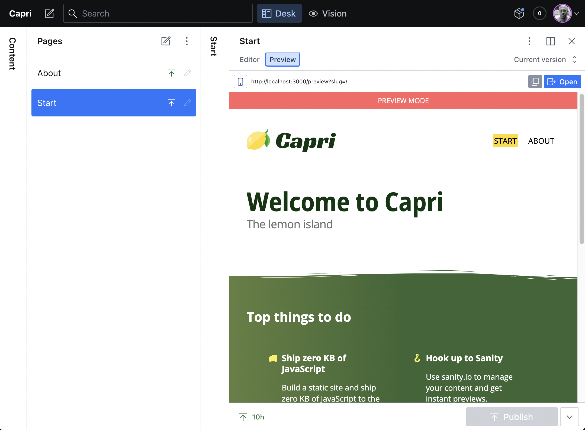

# Generate a static site with React + Capri

[Capri](https://github.com/capri-js/capri) is a static site generator for React/Preact/SolidJS.

This Sanity starter template uses React components to build a site that ships zero KB of JavaScript to the client in production.

While editing your content, you get live previews of your drafts directly in the Sanity studio via an SPA that gets embedded inside an iframe.

